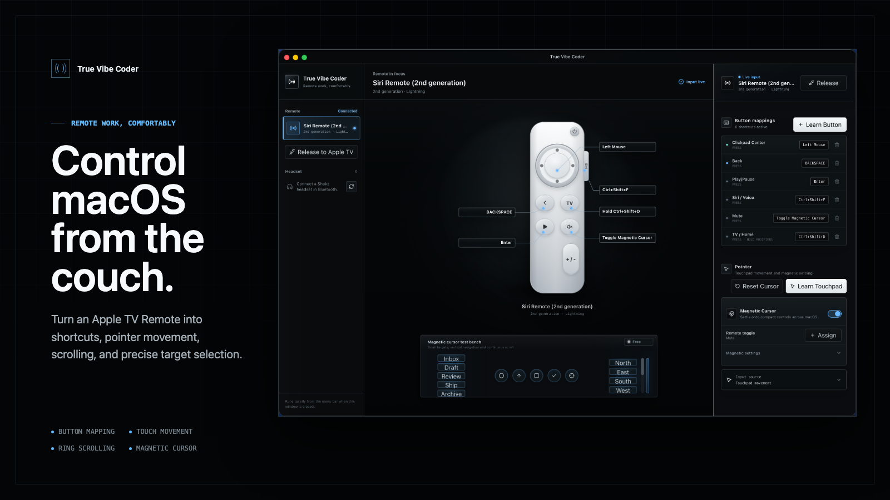
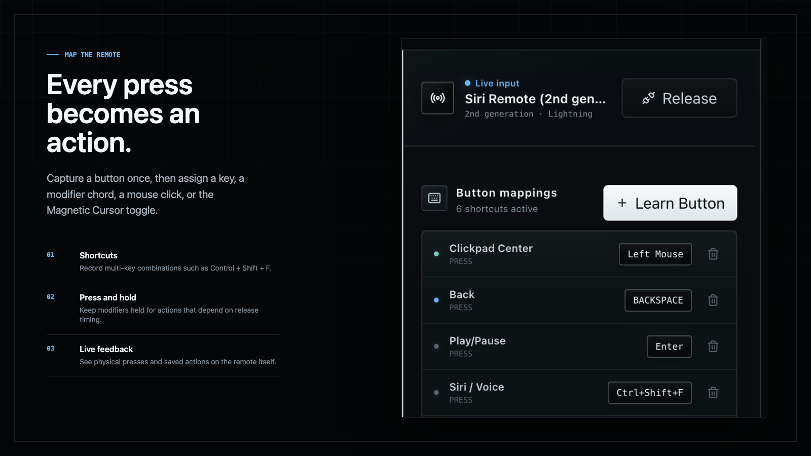
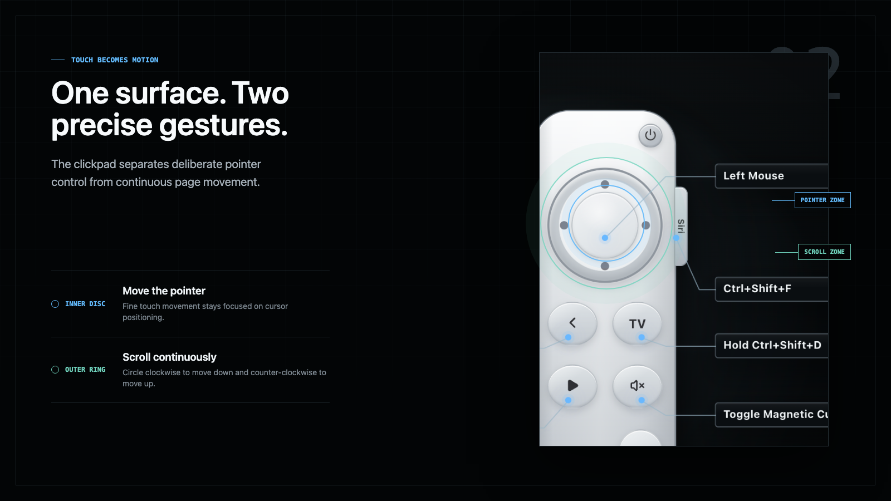
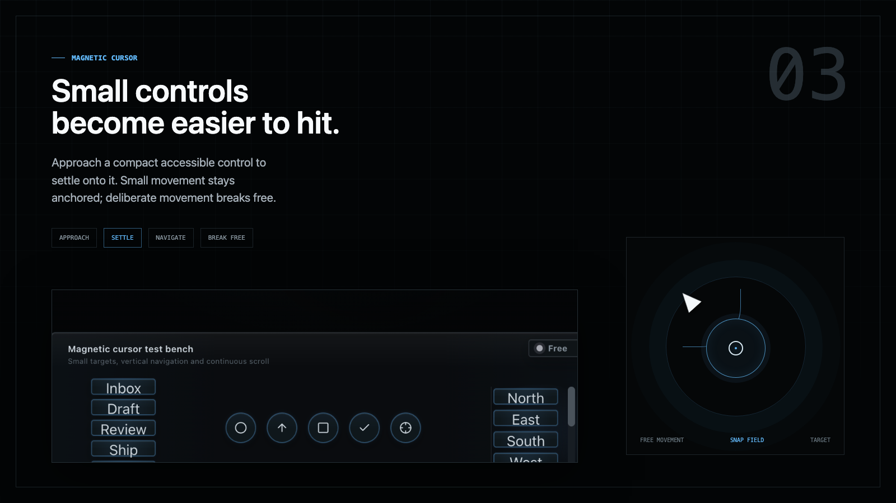

<p align="center">
  
</p>

<h1 align="center">True Vibe Coder</h1>

<p align="center"><strong>Remote work, comfortably.</strong></p>

<p align="center">
  Turn an Apple TV Remote into shortcuts, pointer movement, continuous scrolling, and precise target selection on macOS.
</p>

<p align="center">
  <a href="README.zh-CN.md">中文</a>
  ·
  <a href="#build-from-source">Build from source</a>
  ·
  <a href="LICENSE">MIT License</a>
</p>

<p align="center">
  
  
  
</p>



## An input surface for relaxed work

True Vibe Coder is a macOS utility for controlling a computer from a sofa, desk edge, or across the room. It keeps the physical simplicity of the Siri Remote while adding deliberate keyboard, mouse, scrolling, and pointer-assistance behavior.

### Map the remote



Learn a physical button, then assign a key, modifier chord, mouse click, or the built-in Magnetic Cursor toggle. Press and hold behavior preserves modifier timing for shortcuts that depend on the key-up sequence, and the remote preview shows both the saved action and live input.

### Use touch for pointer and scroll



On supported silver Siri Remotes, the inner clickpad drives fine pointer movement. Circular movement around the outer ring becomes continuous scrolling, with direction locking and acceleration to keep long pages fluid.

### Settle onto small controls



Magnetic Cursor uses macOS Accessibility information to identify compact controls. Approaching a target settles the pointer onto it, small motion remains anchored, and deliberate movement breaks free. Directional remote presses can move between nearby accessible targets while snapped.

## What it supports

- Apple TV Remote button, hold, shortcut, click, and touch-surface mapping
- Inner-disc pointer movement and outer-ring continuous scrolling
- Magnetic assistance for small controls exposed through macOS Accessibility
- Live button and touch feedback on the matching remote preview
- Persistent remote mappings and optional system Play/Pause shortcut capture
- Menu bar availability after the main window is closed
- A deliberate **Release to Apple TV** action that closes HID access before handoff

## Connect a remote

1. Open **System Settings → Bluetooth** on the Mac.
2. Temporarily unplug the Apple TV or move the remote out of its range so it does not reconnect there first.
3. On a silver second- or third-generation remote, hold **Back + Volume Up** for five seconds. On a black first-generation remote, hold **Menu + Volume Up**.
4. Choose **Connect** when the remote appears, then open True Vibe Coder and select **Refresh** or **Connect Remote**.
5. Grant Accessibility permission when macOS asks. Keyboard, mouse, scrolling, and target assistance require it.

Apple officially documents pairing the remote with Apple TV. Using it as a general Mac input device is an unofficial workflow, and the remote does not provide AirPods-style automatic switching between the Mac and Apple TV.

## Remote handoff

Choose **Release to Apple TV** before reconnecting the remote to an Apple TV. Place it close to the Apple TV and hold **Back + Volume Up** for five seconds. The app releases WebHID and native HID access and pauses its automatic reconnection path.

## Technical boundaries

- Magnetic Cursor depends on the macOS Accessibility tree. Custom-rendered or inaccessible controls may not expose a usable target.
- Bluetooth ownership remains controlled by the remote and operating systems. True Vibe Coder can release its own HID access, but it cannot add automatic device switching to the remote.
- macOS exposes Play/Pause as a system-wide media command. While headset override is active, the same media key from another input can also trigger the mapped shortcut.
- Keyboard and pointer output are macOS-only in the current implementation.

## Build from source

```bash
npm install
node scripts/build-apple-remote-helper.js
npm run dev
```

The helper build requires Xcode Command Line Tools. Build the native helpers and desktop package with:

```bash
npm run build
```

The native Apple Remote helper lives in `helpers/apple-remote-helper.swift`. Renderer input handling is in `src/hooks/useAppleRemote.ts`, while keyboard, mouse, pointer assistance, and helper lifecycle are managed in `electron/main/index.ts`.

## License

MIT. See [LICENSE](LICENSE) for the copyright notice and terms.
